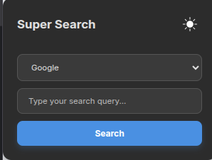
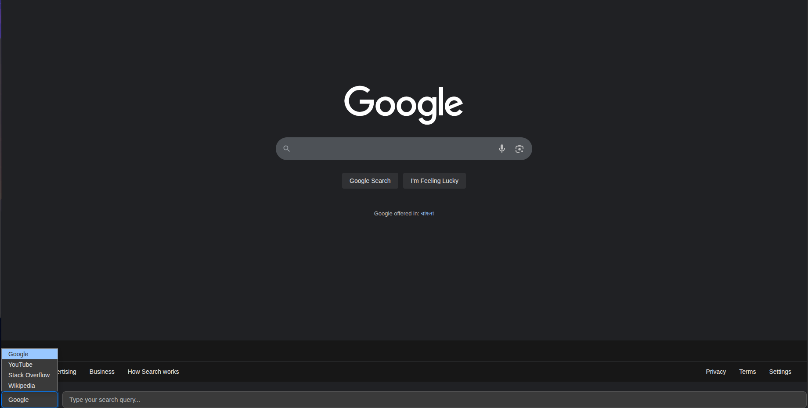

# 🚀 Super Search Launcher

**Instantly search Google, YouTube, Stack Overflow, or Wikipedia from any webpage – without leaving your flow.**

---

  

## ✨ Features

- **🔍 Floating Search Bar:**  
  Press <kbd>Alt</kbd>+<kbd>S</kbd> on any page to launch a beautiful, distraction-free search bar right over the site you’re on.

- **⚡ Quick Popup Search:**  
  Click the extension icon for a fast, clean popup search – perfect for quick queries.

- **🌗 Light & Dark Mode:**  
  Switch seamlessly between light and dark themes, synced across popup and search bar.

- **🔗 Choose Your Search Engine:**  
  Instantly search with Google, YouTube, Stack Overflow, or Wikipedia.

- **🖱️ Intuitive Controls:**  
  - Press <kbd>Esc</kbd> or click outside to close the floating bar.
  - Use <kbd>Enter</kbd> to search.
  - Re-press <kbd>Alt</kbd>+<kbd>S</kbd> to hide the bar.

- **🎨 Modern, Responsive UI:**  
  Clean, modern design with beautiful transitions and mobile-friendly layout.

---

## 📸 Preview

<!-- Replace with your own screenshots/gifs -->

  

---

## 🚦 How to Use

1. **Install**
   - Download or clone this repository.
   - Go to `chrome://extensions` and enable **Developer mode**.
   - Click **Load unpacked** and select this project folder.

2. **Instant Search from Any Page**
   - Press <kbd>Alt</kbd>+<kbd>S</kbd> to open the floating search bar.
   - Type your query, select an engine, and hit <kbd>Enter</kbd>.
   - Press <kbd>Esc</kbd> or <kbd>Alt</kbd>+<kbd>S</kbd> again to close.

3. **Popup Search**
   - Click the extension icon in your browser toolbar.
   - Type your query and hit **Search**.

4. **Theme Toggle**
   - Use the theme toggle button in the popup to switch between light and dark modes.
   - Theme syncs instantly across all open tabs and the floating bar.

---

## ⚙️ Permissions

- **activeTab** – Needed to inject the floating search bar.
- **storage** – To remember your theme preference.
- **scripting** – For dynamic content script handling.
- **<all_urls>** – To allow searching from any website.

---

## 🛡️ Security & Privacy

- No data is collected or tracked.
- All searches are performed directly via your selected search engine.

---

## 💡 Ideas for the Future

- Add support for custom search engines.
- Make the search bar draggable.
- Keyboard navigation and accessibility improvements.
- More visual themes.

---

## 🧑‍💻 Contributing

Pull requests are welcome!  
If you have suggestions or find bugs, please [open an issue](https://github.com/YOUR_USERNAME/Super-Search-Launcher/issues).

---

## 📄 License

MIT License

---

**Enjoy faster, smarter searching – right where you need it! 🚀**

  
  

